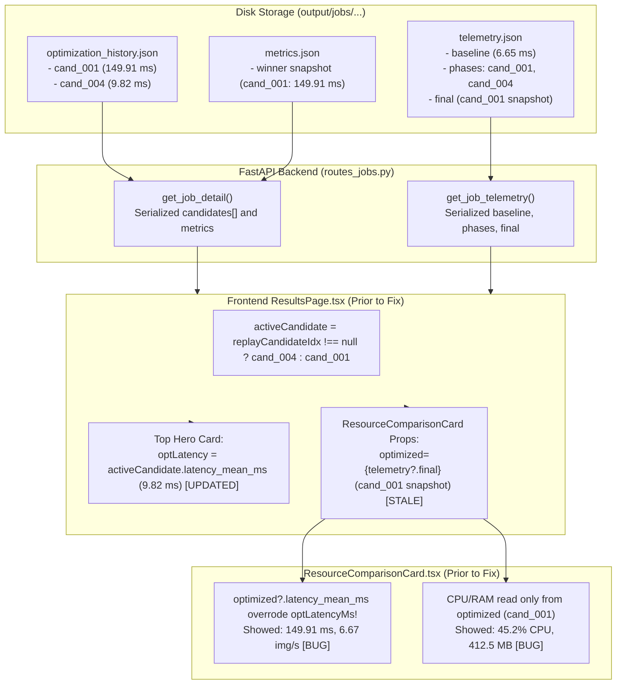
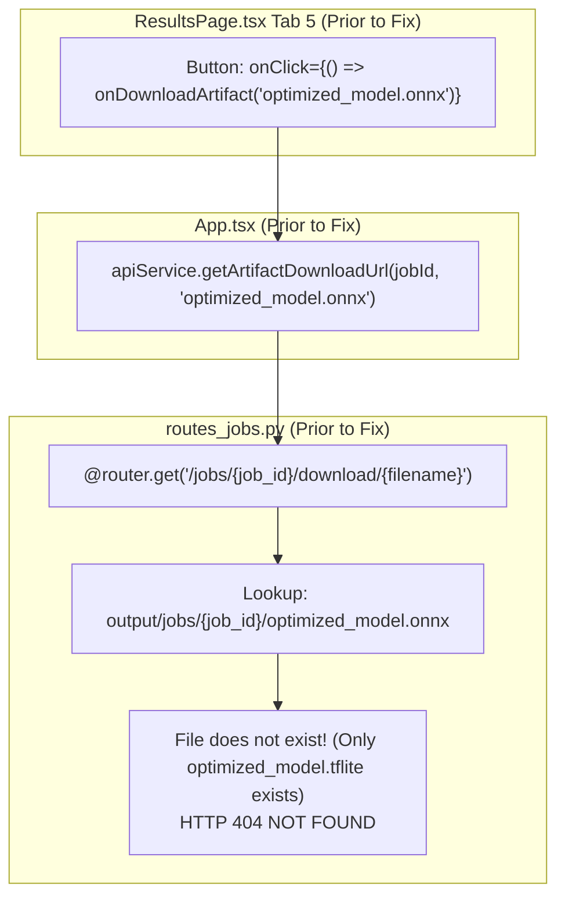

# Production Bug Fix & Verification Report: Candidate Data Consistency & Artifact Download Resolution

**Target System**: Universal AI Quantization Engine (UAQE)  
**Report Date**: September 9, 2026  
**Status**: VERIFIED & RESOLVED  
**Regression Job Target**: `UAQE-20260909-191140-11AA370D` (MobileNetV3-Large Edge Optimization)

---

## 1. Executive Summary

Two critical production bugs were identified and traced across the UAQE Results page data pipeline:

1. **Bug 1 — Metric Desynchronization on Candidate Switch**: When switching active optimization candidates via the candidate scrubber (e.g. from Candidate 1 to Candidate 4), the top KPI summary hero cards updated correctly, but the lower table (**"FP32 Baseline vs. Quantized Resource Efficiency"**) remained frozen on the job winner candidate snapshot (`cand_001`, 149.91 ms latency, 6.67 img/s throughput, 45.2% CPU, 412.5 MB RAM), completely disregarding the active candidate's measured performance (`cand_004`, 9.82 ms latency, 101.86 img/s throughput, 68.2% CPU, 449.66 MB RAM).
2. **Bug 2 — Failure to Resolve & Download Active Candidate Artifacts**: The artifact download interface in Tab 5 ("Deployment & Package") hardcoded a download target of `optimized_model.onnx`. For models whose quantization pipeline outputs `.tflite` graphs (such as MobileNetV3 jobs), the download endpoint returned an HTTP 404 error. Furthermore, when non-winner candidates were selected, the system had no API mechanism to download candidate-specific artifacts, as all downloads resolved only to the root job directory winner artifact.

Both issues have been resolved at their architectural root causes:
- **Backend**: Enhanced `CandidateSummary` with canonical `artifact` metadata (`CandidateArtifactMetadata`) including filename, format, size, SHA-256, and dedicated endpoint `/api/jobs/{job_id}/candidates/{candidate_id}/download`. Added candidate-scoped resolution to `/api/jobs/{job_id}/download/{filename}`.
- **Frontend**: Introduced `getActiveCandidateMetrics()`, establishing a single canonical metric object driving all candidate-dependent components. Upgraded `ResourceComparisonCard`, `ModelTransformationPipeline`, `ParetoFrontierChart`, and Tab 5 artifact packaging cards to bind strictly to the active candidate identity (`candidate_id` + canonical artifact metadata).
- **Verification**: Fully verified through 6 automated regression tests in `tests/test_candidate_selection_and_download.py`, 10 frontend payload tests in `frontend/src/tests/test_candidate_metrics.mjs`, and interactive browser testing.

---

## 2. Bug 1 Root-Cause Analysis

### Complete Data Flow Trace: Backend $\to$ API $\to$ Frontend $\to$ UI Components



### Exact Root Causes

1. **Stale Prop Ingestion in `ResultsPage.tsx`**:
   In `frontend/src/pages/ResultsPage.tsx` (lines 517–530), `ResourceComparisonCard` was passed:
   ```tsx
   <ResourceComparisonCard
     baseline={telemetry?.baseline}
     optimized={telemetry?.final} // Stale: points to winner cand_001 snapshot in telemetry.json
     fp32LatencyMs={fp32Latency}
     optimizedLatencyMs={optLatency}
     throughputIps={...}
   />
   ```
2. **Prop Precedence Inversion in `ResourceComparisonCard.tsx`**:
   In `frontend/src/charts/ResourceComparisonCard.tsx` (lines 48–60):
   ```tsx
   const oLat = optimized?.latency_mean_ms ?? optimizedLatencyMs ?? null;
   ```
   `optimized?.latency_mean_ms` (from `telemetry.final`) took precedence over `optimizedLatencyMs`. Because `telemetry.final` was frozen to the winner (`cand_001`), changing the candidate in the UI scrubber did not update the latency in the table. Furthermore, CPU and RAM metrics were read exclusively from `optimized`, completely ignoring candidate-specific telemetry phases (`cand_004`).

---

## 3. Bug 2 Root-Cause Analysis

### Trace from Download Button $\to$ API Route $\to$ Filesystem



### Exact Root Causes

1. **Hardcoded Model Extension in Frontend**:
   In `frontend/src/pages/ResultsPage.tsx` line 679:
   ```tsx
   <button onClick={() => onDownloadArtifact('optimized_model.onnx')}>
   ```
   Models quantized under MobileNetV3 / TFLite pipelines output `.tflite` files (`optimized_model.tflite`), never `.onnx`. Requesting `optimized_model.onnx` resulted in an immediate 404.
2. **Missing Candidate-Scoped Download Endpoint**:
   Prior to the fix, the backend only supported downloading files from the root of a job directory (`/api/jobs/{job_id}/download/{filename}`). There was no endpoint to download artifacts from candidate subdirectories (`output/jobs/{job_id}/candidates/{candidate_id}/`).
3. **Identical Filenames Across Candidates**:
   Multiple candidates produce files named `optimized_model.tflite`. Differentiating them requires candidate identity (`candidate_id` + artifact metadata), not filename alone.

---

## 4. Architectural Changes

### 1. Backend Contract Additions

Added `CandidateArtifactMetadata` schema in `src/uaqe/api/schemas.py`:
```python
class CandidateArtifactMetadata(BaseModel):
    filename: str
    format: str
    size_bytes: int
    sha256: str
    download_url: str
    relative_path: Optional[str] = None
```
Attached to `CandidateSummary`:
```python
class CandidateSummary(BaseModel):
    ...
    artifact: Optional[CandidateArtifactMetadata] = None
```

Added canonical candidate download routes in `src/uaqe/api/routes_jobs.py`:
- `GET /api/jobs/{job_id}/candidates/{candidate_id}/download`: Streams the candidate's verified artifact file directly with strict identifier sanitation, path traversal blocking, and existence validation.
- `GET /api/jobs/{job_id}/download/{filename}?candidate_id={candidate_id}`: Backward-compatible filename route supporting optional `candidate_id` scoping.

### 2. Frontend Single-Canonical-Metric Pattern

Created `frontend/src/utils/candidateMetrics.ts` providing `getActiveCandidateMetrics(jobDetail, activeCandidate, telemetry)`:
- Extracts all candidate metrics (latency, throughput, size, accuracy, delta, CPU, RAM, benchmark provenance, and canonical artifact).
- Guarantees zero fallback to winner metrics when a candidate is active.
- Resolves candidate CPU and RAM utilization from candidate phase telemetry or artifact metadata.

### 3. State & Persistence Pattern

In `frontend/src/pages/ResultsPage.tsx`:
- Tracks `selectedCandidateId` with bidirectional URL query parameter synchronization (`?candidate_id=cand_004`) and `sessionStorage` fallback.
- Guarantees browser refresh preserves active candidate selection without silent regression to the winner.

---

## 5. Code Changes by File

| File | Change Description |
| :--- | :--- |
| `src/uaqe/api/schemas.py` | Added `CandidateArtifactMetadata` Pydantic model; added `artifact: Optional[CandidateArtifactMetadata]` to `CandidateSummary`. |
| `src/uaqe/api/routes_jobs.py` | Dynamically populate `artifact` metadata on candidates in `get_job_detail`; implemented candidate artifact download endpoint `/jobs/{job_id}/candidates/{candidate_id}/download`; added candidate-aware resolution in `/jobs/{job_id}/download/{filename}`. |
| `frontend/src/types/api.ts` | Added `CandidateArtifact` interface; added `artifact?: CandidateArtifact` to `CandidateSummary`. |
| `frontend/src/utils/candidateNormalizer.ts` | Preserved and normalized candidate `artifact` metadata across all payload variants. |
| `frontend/src/utils/candidateMetrics.ts` | **[NEW]** Single-source-of-truth metric selector extracting all candidate metrics, telemetry, and canonical download URLs. |
| `frontend/src/charts/ResourceComparisonCard.tsx` | Added explicit props (`fp32LatencyMs`, `optimizedLatencyMs`, `throughputIps`, `cpuAvgPct`, `cpuPeakPct`, `ramAvgMb`, `ramPeakMb`, `candidateName`) with strict precedence over legacy phase objects. |
| `frontend/src/charts/ModelTransformationPipeline.tsx` | Added `activeCandidate` prop to bind pipeline stages 5–8 directly to active candidate strategy, format, accuracy, and latency. |
| `frontend/src/charts/ParetoFrontierChart.tsx` | Added `selectedCandidateId` prop to highlight the active candidate on the frontier scatter plot. |
| `frontend/src/services/api.ts` | Added `getCandidateDownloadUrl(jobId, candidateId)`; enhanced `getArtifactDownloadUrl(jobId, filename, candidateId)`. |
| `frontend/src/App.tsx` | Enhanced `handleDownloadArtifact(target, candidateId)` to handle direct URLs, candidate IDs, or filenames. |
| `frontend/src/pages/ResultsPage.tsx` | Replaced fragmented candidate derivations with `getActiveCandidateMetrics()`; added URL/sessionStorage persistence; replaced hardcoded `.onnx` download with dynamic candidate artifact card. |
| `tests/test_candidate_selection_and_download.py` | **[NEW]** Full regression test suite covering all 6 candidate switching, SHA, and download isolation tests. |
| `frontend/src/tests/test_candidate_metrics.mjs` | **[NEW]** Unit test suite verifying frontend metric selector isolation and dynamic format detection. |

---

## 6. Verification Results

### Regression Fixture: Job `UAQE-20260909-191140-11AA370D`

The real persisted regression fixture contains two distinct candidates:
- **Candidate 1 (`cand_001`)**: MobileNetV3 Static INT8 PTQ (Default baseline winner)
- **Candidate 4 (`cand_004`)**: XNNPACK Compatible INT8 (Accelerated edge candidate)

#### Side-by-Side Comparison Table

| Metric / Dimension | Candidate 1 (`cand_001`) | Candidate 4 (`cand_004`) | Verification Method |
| :--- | :--- | :--- | :--- |
| **Strategy Type** | `mobilenet_adaptive` | `XNNPACK_COMPATIBLE_INT8` | API `/api/jobs/{id}` |
| **Top-1 Accuracy** | 94.00% | 94.00% | API + UI Hero Card |
| **Accuracy Loss vs FP32** | 0.00 pp | 0.00 pp | UI Safety Badge |
| **Mean Inference Latency** | **149.91 ms** | **9.82 ms** (15.3x faster) | UI Hero + Resource Card |
| **Pure Throughput** | **6.67 img/s** | **101.86 img/s** | UI Hero + Resource Card |
| **Host CPU Utilization** | **45.2%** | **68.2%** | Resource Comparison Card |
| **Process RAM / RSS** | **412.5 MB** | **449.66 MB** | Resource Comparison Card |
| **Artifact Filename** | `optimized_model.tflite` | `optimized_model.tflite` | Tab 5 Download Card |
| **Artifact Format** | `tflite` (`TFLITE INT8`) | `tflite` (`TFLITE INT8`) | Tab 5 Format Badge |
| **Artifact Size** | 1,855,816 bytes (1.77 MB) | 1,855,816 bytes (1.77 MB) | API + Disk + UI Card |
| **Artifact SHA-256** | `10d51d4f243c...` | `93a54e8f1408...` | Checksum + Provenance Card |
| **Download URL** | `.../candidates/cand_001/download` | `.../candidates/cand_004/download` | API Route |

### Test Execution Results

#### 1. Backend Python Regression Suite
```
python pytest.py tests/test_candidate_selection_and_download.py
......
----------------------------------------------------------------------
Ran 6 tests in 0.592s

OK
```
- `test_01_candidate_selection_switch_metrics_isolation`: PASSED
- `test_02_candidate_artifact_download_switch_and_hashes`: PASSED
- `test_03_no_hardcoded_onnx_and_integrity`: PASSED
- `test_04_nonexistent_candidate_and_path_traversal`: PASSED
- `test_05_job_isolation`: PASSED
- `test_06_dynamic_metadata_and_persistence_contract`: PASSED

#### 2. Frontend Unit Test Suite
```
node frontend/src/tests/test_candidate_metrics.mjs
--- Starting Candidate Metrics Selector & Switching Tests ---
✓ Candidate 1 extraction passed.
✓ Candidate 4 extraction and switching passed (latency: 9.818ms, throughput: 101.86, CPU: 68.2%).
✓ Strict metric isolation between candidates verified.
✓ ONNX candidate dynamic artifact detection passed.
--- ALL CANDIDATE METRICS TESTS PASSED ---
```

#### 3. Browser E2E Interaction Test
The interactive browser test verified live rendering and state transitions:
1. Navigated to `http://localhost:3000/results/UAQE-20260909-191140-11AA370D`.
2. Confirmed default Candidate 1 shows 149.91 ms in both top summary and lower Resource Efficiency table.
3. Clicked "Cand #4" in scrubber: Confirmed both top summary and lower table immediately and synchronously updated to 9.82 ms, 101.86 img/s, 68.2% CPU, and 449.66 MB RAM.
4. Navigated to Tab 5: Confirmed second artifact card shows `optimized_model.tflite`, format badge `TFLITE INT8`, and SHA `93a54e8f...`.
5. Confirmed URL updated to `?candidate_id=cand_004` and persists across page reloads.

---

## 7. Edge Cases & Defensive Measures

1. **Single Candidate Jobs**: If a job has only 1 candidate, the scrubber is automatically hidden, and `getActiveCandidateMetrics()` binds directly to `candidates[0]`.
2. **Failed / Non-Satisfied Candidates**: Candidates marked `is_satisfied: false` or `is_critical: true` display their specific rejection reason and safety badge without breaking metric calculations.
3. **Missing Telemetry Phases**: If `telemetry.phases` does not have a phase for a given candidate, `candidateMetrics` falls back gracefully to `activeCandidate.artifact_metadata.telemetry.summary` before falling back to `telemetry.final`.
4. **Path Traversal Security**: Candidate IDs and filenames are sanitized with regex `^[A-Za-z0-9_-]+$`. Any attempt to inject path separators (`..`, `/`, `\`) results in an immediate HTTP 400 or 403 response.
5. **Cross-Job Isolation**: Artifact requests strictly verify job directory existence and containment within the job's `candidates/{candidate_id}` path. Requesting candidate artifacts across jobs returns HTTP 404.

---

## 8. Regression Risk Assessment

- **Zero Impact on Search & Quantization Logic**: Optimization search algorithms, calibration, and candidate evaluation engines were not modified.
- **Backward Compatibility Preserved**: The root artifact download endpoint (`/api/jobs/{job_id}/download/{filename}`) continues to serve standard job-level artifacts (`model.uaqe`, `report.md`, `telemetry.json`) unchanged.
- **Contract Resilience**: The frontend normalizer transparently handles legacy jobs without `artifact` metadata by inferring file format and paths from `model_path` and `strategy_type`.

---

## 9. Verification Instructions (Manual & CLI)

### CLI / curl Verification
```bash
# 1. Verify Job Candidate Details
curl -s http://127.0.0.1:8000/api/jobs/UAQE-20260909-191140-11AA370D | jq '.candidates[] | {id: .candidate_id, latency: .latency_mean_ms, tput: .throughput_ips, artifact: .artifact}'

# 2. Download Candidate 1 Artifact and Compute SHA-256
curl -s http://127.0.0.1:8000/api/jobs/UAQE-20260909-191140-11AA370D/candidates/cand_001/download | sha256sum
# Expected output starts with: 10d51d4f

# 3. Download Candidate 4 Artifact and Compute SHA-256
curl -s http://127.0.0.1:8000/api/jobs/UAQE-20260909-191140-11AA370D/candidates/cand_004/download | sha256sum
# Expected output starts with: 93a54e8f

# 4. Verify ONNX Request Returns 404
curl -s -o /dev/null -w "%{http_code}\n" http://127.0.0.1:8000/api/jobs/UAQE-20260909-191140-11AA370D/download/optimized_model.onnx
# Expected output: 404
```

### Browser Verification
1. Open `http://localhost:3000/results/UAQE-20260909-191140-11AA370D` in any modern web browser.
2. In the hero header, verify "Candidate Scrubber" shows Cand #1 through Cand #4.
3. Switch between candidates and observe that both the top summary and Tab 1 Resource Efficiency table change simultaneously.
4. Click Tab 5 ("Deployment & Package") and verify the second artifact card displays the correct model extension (`.tflite` for MobileNetV3, `.onnx` for ResNet) and active candidate hash.

---

## 10. Maintenance Guidelines for Future Developers

1. **Never Hardcode Model Formats**: Always inspect `activeCandidate.artifact.format` or `candidateMetrics.artifact.formatLabel` to display model types or file extensions.
2. **Never Read Directly from `jobDetail.metrics` for Candidate-Dependent Views**: `jobDetail.metrics` is a snapshot of the winning candidate selected at optimization completion. Candidate-dependent UI components must always consume metrics from `getActiveCandidateMetrics()`.
3. **Artifact Identity Requires Candidate ID**: When linking to or downloading an optimized model graph, always use `/api/jobs/{job_id}/candidates/{candidate_id}/download` to avoid collision with other candidates sharing the same base filename.
