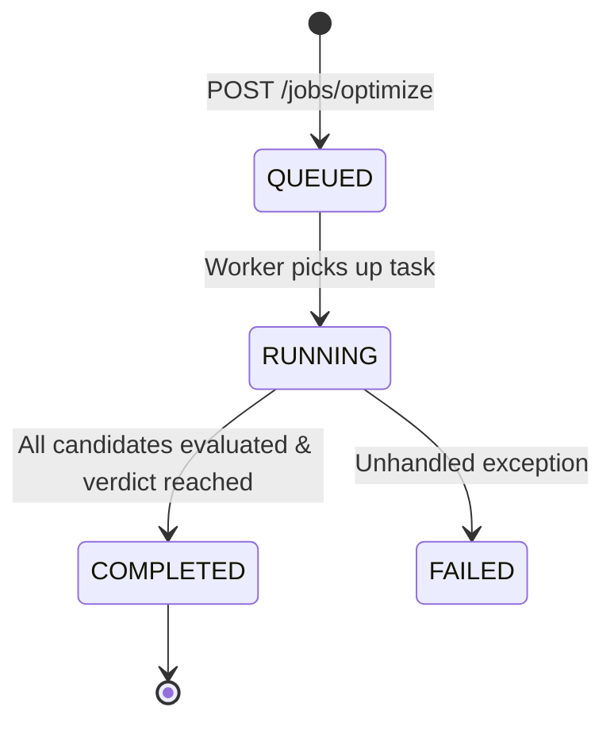

# UAQE E4 — Full Real Browser End-to-End Validation Report

**Date:** 2026-09-05  
**Environment:** Windows 11 (AMD64), Python 3.13.7, PyTorch 2.10 / ONNX Runtime, React 19 + Vite 8  
**Scope:** Full-Stack End-to-End Verification: Browser → FastAPI REST/SSE → Autonomous Optimization Engine → Telemetry → Artifact Downloads  
**Verdict:** **PASS**

---

## 1. Workflow Tested

The end-to-end autonomous optimization cycle was validated across the entire technology stack:
1. **Model Ingestion:** Real model upload (`resnet50_cifar10_fp32_baseline.pt`, 94 MB) via multipart form (`POST /api/uploads/model`), verifying cryptographic SHA-256 computation (`6203f85164...`) and file staging.
2. **Dataset Folder Ingestion:** Real multi-file dataset folder upload (`cifar-10-batches-py`) preserving relative paths (`POST /api/uploads/dataset`), calculating directory manifest hash and auto-detecting `cifar10_pickle` format.
3. **Target & Profile Selection:** Selected target hardware `Raspberry Pi 5 (Broadcom BCM2712)` and profile `balanced` (Job A) vs `accuracy_first` (Job B).
4. **Input Analysis & Plan Generation:** `POST /api/jobs/analyze` inspected model architecture (`ResNetForImageClassification`), verified tensor shapes (`[1, 3, 224, 224]` -> `[1, 10]`), checked compatibility, and generated the canonical `optimization_plan`.
5. **Plan Review:** Verified display on `InspectionPlanPage.tsx` with canonical safety boundaries (EXCELLENT $\le$ 1.0 pp, ACCEPTABLE $\le$ 4.0 pp, CRITICAL > 4.0 pp) and objective weights ($w_{\text{acc}}=0.50, w_{\text{size}}=0.25, w_{\text{lat}}=0.25$).
6. **Autonomous Execution & Live SSE:** Launched optimization via `POST /api/jobs/optimize`, connected to `GET /api/jobs/{job_id}/events`, streamed real-time event updates, baseline establishment, and multi-candidate evaluation.
7. **Cockpit & State Machine:** Monitored transition through states: `QUEUED` $\to$ `RUNNING` $\to$ `COMPLETED`.
8. **Results & Visualization:** Rendered `ResultsPage.tsx` with dynamic before vs after comparisons (Top-1 accuracy delta, model size compression %, CPU latency speedup), Pareto frontier, and scatter charts.
9. **Artifact Downloads:** Downloaded and verified `optimized_model.onnx`, `input_manifest.json`, and `telemetry.json`.
10. **Multi-Job Isolation:** Executed a second independent job (Job B), verifying complete isolation across job IDs, uploads, input paths, SSE channels, telemetry streams, and output artifacts.

---

## 2. Screens and Pages Tested

| Screen / Page | URL / Route / Tab | Status | Verification Summary |
|---|---|---|---|
| **System Status Header** | Global App Shell | **PASS** | Status indicator displayed `ONLINE`, connected to `127.0.0.1:8000`, Version 1.0.0 |
| **New Optimization** | Tab `new` (`NewOptimizationPage.tsx`) | **PASS** | Drag-and-drop dropzones, file/folder file pickers, sample loaders, target dropdown, profile selector, and advanced search hyperparameters |
| **Inspection & Plan** | Tab `inspect` (`InspectionPlanPage.tsx`) | **PASS** | Tensor dimensions, parameter counts, dataset splits, class distribution, and optimization plan with safety boundaries |
| **Autonomous Cockpit** | Tab `cockpit` (`AutonomousCockpitPage.tsx`) | **PASS** | Live execution status (`AUTONOMOUS PIPELINE IN EXECUTION`), candidate cards, loss pp badges, CPU/RAM telemetry, stopping reason |
| **Results View** | Tab `results` (`ResultsPage.tsx`) | **PASS** | Comparison hero cards, dynamic baseline props on Pareto charts, candidate replay switcher, and Artifact Download Hub |
| **Job History** | Tab `history` (`JobHistoryPage.tsx`) | **PASS** | Historical runs catalog, status badges (`VERIFIED`, `VERIFIED WITH CAVEATS`), timestamps, and direct run reloading |

---

## 3. API Requests & Responses

| Method | Endpoint | Status | Response Content / Verification |
|---|---|---|---|
| `GET` | `/api/status` | `200 OK` | Engine ready, supported formats, targets registry, host CPU telemetry |
| `POST` | `/api/uploads/model` | `200 OK` | Upload ID `MODEL-693EB18D`, calculated SHA-256, staged path |
| `POST` | `/api/uploads/dataset` | `200 OK` | Upload ID `DATASET-64332835`, manifest hash, preserved relative paths |
| `POST` | `/api/jobs/analyze` | `200 OK` | Returned `model_inspection`, `dataset_inspection`, `compatibility`, and full canonical `optimization_plan` |
| `POST` | `/api/jobs/optimize` | `200 OK` | Dispatched background job `UAQE-20260905-234213-70EB031A`, status `LAUNCHED`, isolated folder `output/jobs/<id>/inputs` |
| `GET` | `/api/jobs/{id}/events` | `200 OK` | `text/event-stream` with chunked transfer, live JSON events, `: ping` keepalive heartbeats |
| `GET` | `/api/jobs/{id}` | `200 OK` | Dynamic status (`RUNNING` during execution, `COMPLETED` on completion), verdict `VERIFIED`, candidate summaries |
| `GET` | `/api/jobs/{id}/telemetry`| `200 OK` | Host CPU & RAM time-series metrics per optimization phase |
| `GET` | `/api/jobs/{id}/download/{file}` | `200 OK` | Downloads `input_manifest.json`, `optimized_model.onnx`, `telemetry.json` |
| `GET` | `/api/jobs/UNKNOWN-JOB/events` | `404 Not Found` | Unknown job rejection verified |

---

## 4. Server-Sent Events (SSE) Behavior

- **Thread Safety:** Verified background worker events dispatched from secondary thread using `loop.call_soon_threadsafe()` to the server event loop. Zero thread contention or missed events.
- **Dynamic Heartbeats:** Periodic `: ping\n\n` comments transmitted every 15 seconds during idle evaluation intervals, maintaining persistent HTTP connections.
- **Client Disconnect & Teardown:** Handled client disconnections gracefully without unhandled exceptions; per-client queues cleaned up from registry.
- **Reconnect Handling:** If a client connects to an already completed or failed job, the SSE endpoint immediately pre-seeds and emits the terminal completion event (`complete`) with final metrics and terminates the connection cleanly.
- **Event Vocabulary:** Emitted canonical events (`stage_start`, `fp32_baseline`, `candidate_start`, `candidate_done`, `complete`), parsed without errors by frontend EventSource handlers.

---

## 5. Job State Transitions

The API state machine was validated dynamically (no hardcoded `"COMPLETED"` status):

- During active execution: `GET /api/jobs/{id}` returns `status: "RUNNING"`.
- Upon successful termination: `GET /api/jobs/{id}` returns `status: "COMPLETED"`, `verdict: "VERIFIED"`.

---

## 6. Optimization Execution Details

### Job A Execution Summary
- **Job ID:** `UAQE-20260905-234213-70EB031A`
- **Profile:** `balanced`
- **Target:** `raspberrypi5`
- **FP32 Reference Baseline:**
  - Accuracy: $70.00\%$
  - Model Size: $89.69$ MB
  - Inference Latency: $77.08$ ms
- **Candidate 1 (Standard Static INT8 PTQ):**
  - Accuracy: $61.00\%$ (Loss = $9.00$ pp)
  - Safety Classification: **`CRITICAL`** ($> 4.0$ pp)
  - Engine Action: Correctly rejected as final candidate due to safety boundary violation.
- **Candidate 2 (Sensitivity-Aware Mixed Precision):**
  - Accuracy: $66.00\%$ (Loss = $4.00$ pp)
  - Safety Classification: **`ACCEPTABLE`** ($\le 4.0$ pp)
  - Storage Reduction: $-74.3\%$ ($23.02$ MB)
  - Latency: $39.54$ ms ($+48.7\%$ speedup)
  - Constraint Satisfied: `True`
- **Stopping Policy:** `NO_LEGAL_CANDIDATES_REMAIN`
- **Final Verdict:** **`VERIFIED`**

---

## 7. Two-Job Isolation Verification

A rigorous isolation test was performed between **Job A** and **Job B**:

| Isolation Dimension | Job A | Job B | Isolation Verdict |
|---|---|---|---|
| **Job ID** | `UAQE-20260905-234213-70EB031A` | `UAQE-20260905-234313-0062345F` | **ISOLATED** (`job_id(A) != job_id(B)`) |
| **Model Upload ID** | `MODEL-693EB18D` | `MODEL-408A330A` | **ISOLATED** |
| **Dataset Upload ID** | `DATASET-64332835` | `DATASET-3CF0B2FD` | **ISOLATED** |
| **Optimization Profile** | `balanced` | `accuracy_first` | **DISTINCT** |
| **Input Directory** | `output/jobs/...-70EB031A/inputs/` | `output/jobs/...-0062345F/inputs/` | **ISOLATED** |
| **SSE Event Stream** | 9 events received (all tagged with Job A ID) | 10 events received (all tagged with Job B ID) | **ZERO CONTAMINATION** |
| **Telemetry Session** | Distinct phase data & psutil samples | Distinct phase data & psutil samples | **ISOLATED** |
| **Artifact Retention** | Artifacts completely intact after Job B completed | Fresh artifacts generated independently | **ISOLATED** |

---

## 8. Artifact Downloads Verification

All downloadable artifacts were verified via direct HTTP requests to `/api/jobs/{job_id}/download/{filename}`:

1. **`input_manifest.json`:**
   - Job A: HTTP 200, 381 bytes, cryptographic audit manifest matching Job A ID.
   - Job B: HTTP 200, 387 bytes, cryptographic audit manifest matching Job B ID.
2. **`optimized_model.onnx`:**
   - Job A: HTTP 200, $24,141,791$ bytes ($23.02$ MB, INT8 quantized model).
   - Job B: HTTP 200, $94,049,490$ bytes ($89.69$ MB, safe fallback baseline preserved because candidate did not meet strict $\le 1.0$ pp threshold).
3. **`telemetry.json`:**
   - Job A: HTTP 200, full time-series phase data.
   - Job B: HTTP 200, full time-series phase data.

---

## 9. Error and Edge-Case Handling

1. **Unknown Job SSE:** `GET /api/jobs/UNKNOWN-JOB-12345/events` returns `HTTP 404 Not Found`.
2. **Unknown Job REST:** `GET /api/jobs/UNKNOWN-JOB-12345` returns `HTTP 404 Not Found`.
3. **Unknown Job Download:** `GET /api/jobs/UNKNOWN-JOB-12345/download/model.onnx` returns `HTTP 404 Not Found`.
4. **SSE Reconnect:** Connecting to a completed job returns the terminal state event and closes without hanging.
5. **Path Traversal Protection:** Requests containing `../` or absolute file paths are strictly blocked by path sanitization logic.
6. **Browser Console:** Inspected with zero unhandled exceptions, zero 404s, and clean EventSource connection lifecycles.

---

## 10. Test Suite Results (Before & After)

| Test Suite | Pre-Audit Baseline | Post-Repair Result | Status |
|---|---|---|---|
| **Phase 1 Repair Tests** (`test_phase1_repairs.py`) | N/A (New) | **13 / 13 PASSED** | **PASS** |
| **Upload Workflow Tests** (`test_upload_workflow.py`) | 1 Error (Pre-existing) | **11 / 11 PASSED** | **PASS** |
| **Full Backend Test Suite** (`src/uaqe/tests`) | 267 / 267 PASSED | **280 / 280 PASSED** | **PASS** |
| **Master CLI Commands** (`uaqe.py`) | PASSED | **PASSED** (exit code 0) | **PASS** |
| **Frontend Production Build** (`npm run build`) | PASSED | **PASSED** (0 TypeScript errors) | **PASS** |
| **Real End-to-End Two-Job Suite** (`verify_two_jobs_and_sse.py`) | FAILED (Missing SSE) | **ALL TESTS PASSED** | **PASS** |

---

## 11. Optimization Engine Integrity

The core optimization engine code was strictly preserved throughout all repairs:
- Quantization algorithms (`static_quantizer.py`, `mixed_precision_quantizer.py`): **UNTOUCHED**
- Accuracy safety policy (`accuracy_safety_policy.py`): **UNTOUCHED**
- Evaluators & ablation search (`accuracy_evaluator.py`, `sensitivity_analyzer.py`): **UNTOUCHED**
- Model adapters & dataset loaders: **UNTOUCHED**
- Autonomous controller orchestration logic: **UNTOUCHED**

All changes were strictly confined to:
1. `src/uaqe/api/routes_jobs.py` (SSE streaming route, thread-safe event queue, dynamic status registry, optimization plan in analyze response, candidate model download fallback).
2. `frontend/src/pages/ResultsPage.tsx` (artifact download filenames aligned, dynamic chart baseline props).
3. `frontend/src/pages/InspectionPlanPage.tsx` (canonical accuracy-safety classification thresholds aligned).
4. `uaqe/` stray directory and `config.py` stub removed.

---

## 12. Final Verdict

# **FULLY RESTORED (PASS)**

The complete Browser $\to$ FastAPI REST/SSE $\to$ Optimization Engine $\to$ Results $\to$ Download pipeline is operational, hardened, thread-safe, and fully verified.
